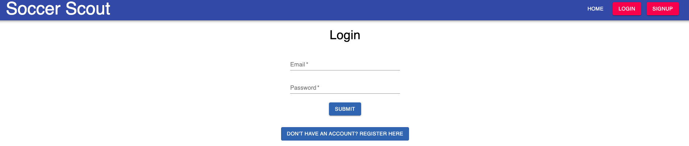
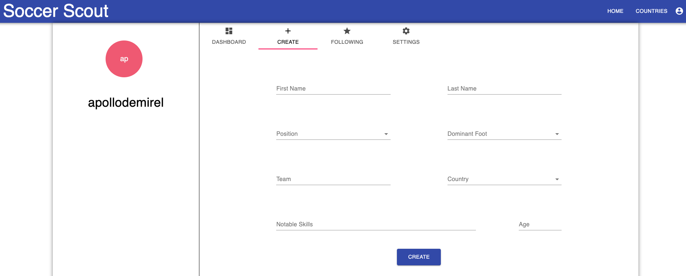
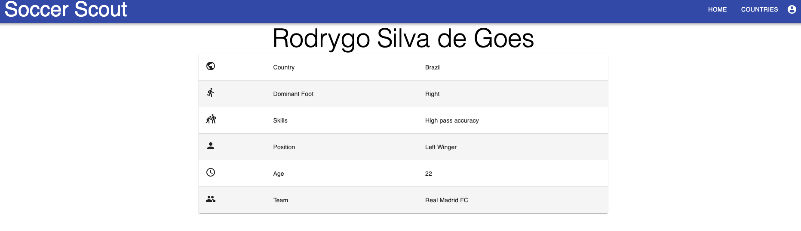
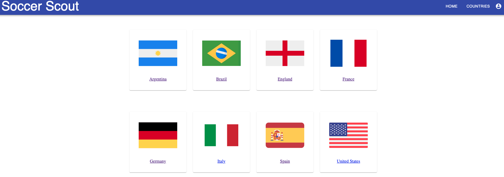

# Soccer Scout

## Table Of Contents

- [Description](#description)
- [Installation](#installation)
- [Contributions](#contributions)
- [Technologies](#Technologies)
- [Screenshots](#screenshots)
- [Links](#links)

## Description

Soccer Scout is a web application that allows scouts to take notes about soccer players they watch in an organized and structured way. Scouts can also view and follow soccer players that other scouts have posted. This app allows scouts to share and view information about players they are interested in and enable discussions about players. 

Scouts need to sign up with an account to create soccer player profiles that store information about the players. Player profiles created by scouts include the player's name, age, position, skills, dominant foot, team, country of origin, and additional comments. 

Scouts can also search players by country if they are interested in players from specific countries. This feature allows scouts to discover players from countries they are interested in and will enable them to find players not well-known.

This full-stack MERN application app was built using MongoDB, Mongoose, GraphQL, Express.js, Node.js, Apollo Server, React, and Material UI. This app provided user authentication via JWT and bcrypt and was deployed on Heroku and MongoDB Atlas.

## Installation

1. Clone the repository
2. Run `npm install` to install dependencies
3. Run `npm run develop` to start the server

## Contributions

- [Apollo Demirel](https://github.com/demiapollo)
- [Frank Colorado](https://github.com/Frank-Colorado)
- [Bader Mahdawi](https://github.com/Badermah)
- [Deshan Meemanage](https://github.com/deltamango777)
- [Kaleo Dutta-Allen](https://github.com/kaleoallen)

## Technologies
Technologies used in this application:

- [React](https://reactjs.org/)
- [MongoDB](https://www.mongodb.com/)
- [Material UI](https://material-ui.com/)
- [GraphQL](https://graphql.org/)
- [Apollo Server](https://www.apollographql.com/)
- [npm](https://www.npmjs.com/)
- [Node.js](https://nodejs.org/en/)
- [Express.js](https://expressjs.com/)
- [bcrypt](https://www.npmjs.com/package/bcrypt)
- [JWT](https://jwt.io/)
- [Heroku](https://www.heroku.com/)
- [MongoDB Atlas](https://www.mongodb.com/cloud/atlas)

## Screenshots 

## Links

- [GitHub Repository](https://github.com/demiapollo/soccerScout)
- [Deployed Application]()
